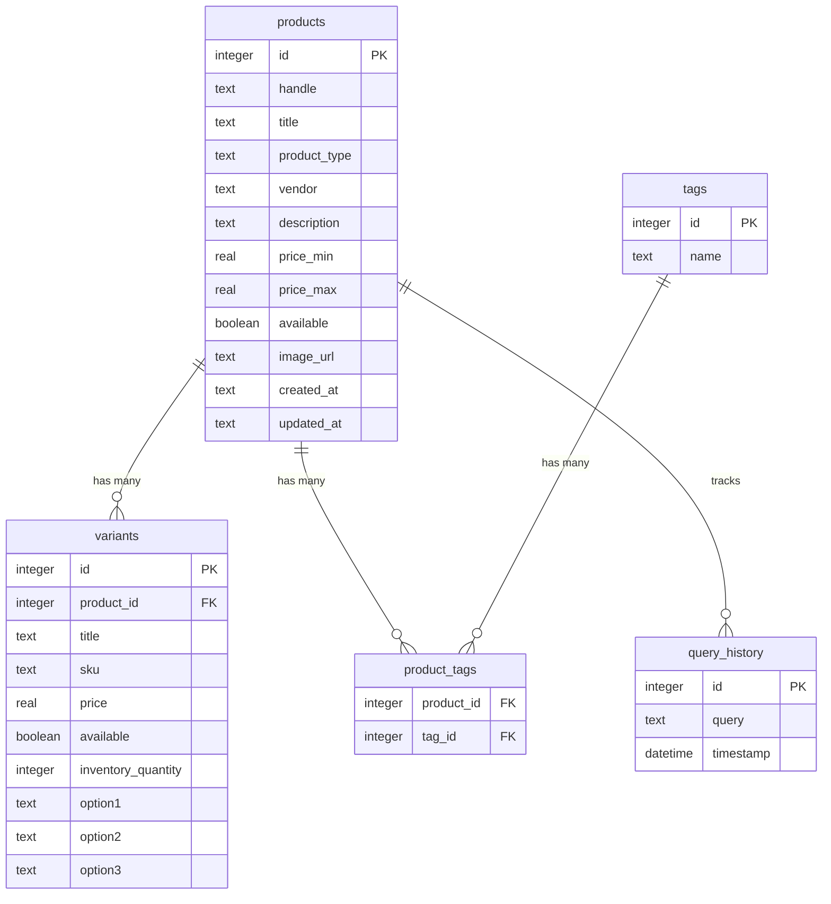

# Fly-Guyde: Natural Language Fly Fishing Database Interface

## Project Description

Fly-Guyde is a Terminal User Interface (TUI) application that allows fly fishers to query a database of 2,117 fly fishing products from Fly Fish Food using natural language. The system uses OpenAI's GPT-3.5-turbo to convert English questions into SQL queries, with an intelligent fallback system that provides fly pattern recommendations and fuzzy search when direct SQL queries fail or return no results.

## Database Schema



### Schema Details

**Products Table**: Core table containing 2,117 fly fishing products with details like title, vendor, price range, and description.

**Variants Table**: Product variants representing different sizes, colors, or configurations of flies.

**Tags Table**: Categorical tags for organizing flies (e.g., 'Dry Flies', 'Streamers', 'Nymphs', 'Saltwater Flies').

**Product_Tags Table**: Many-to-many relationship connecting products to their category tags.

**Query_History Table**: Persistent storage of user queries across sessions for the up/down arrow history feature.

## Sample Successful Query

### Question
> "Show me the 10 cheapest dry flies"

### Generated SQL
```sql
SELECT DISTINCT p.title, p.vendor, p.price_min
FROM products p
JOIN product_tags pt ON p.id = pt.product_id
JOIN tags t ON pt.tag_id = t.id
WHERE t.name = 'Dry Flies'
ORDER BY p.price_min ASC
LIMIT 10;
```

### Response
Found 10 results successfully. The query correctly:
- Joined with the tags table to filter by fly type
- Used exact tag name 'Dry Flies'
- Sorted by minimum price in ascending order
- Limited results to 10 items

**Sample Results:**
| Title | Vendor | Price |
|-------|--------|-------|
| Adams Parachute #16 | Umpqua | 2.25 |
| Elk Hair Caddis Tan #14 | MFC | 2.50 |
| Royal Wulff #12 | Montana Fly | 2.75 |
| Blue Wing Olive #18 | Umpqua | 2.95 |
| Stimulator Orange #10 | MFC | 3.00 |

## Sample Failed Query

### Question
> "What flies work for bonefish in Hawaii?"

### Generated SQL (Initial Attempt)
```sql
SELECT DISTINCT p.title, p.vendor, p.price_min
FROM products p
JOIN product_tags pt ON p.id = pt.product_id
JOIN tags t ON pt.tag_id = t.id
WHERE (t.name LIKE '%bonefish%' OR t.name LIKE '%Hawaii%')
  AND p.description LIKE '%bonefish%'
ORDER BY p.price_min;
```

### Result
**0 rows returned** - The query was too specific. The database doesn't have tags for "bonefish" or "Hawaii", and few products mention these terms in descriptions.

### Fallback: Recommendation Mode
The system automatically activated recommendation mode:

**ChatGPT Recommendations:**
- Gotcha
- Crazy Charlie
- Bonefish Clouser
- Mantis Shrimp
- Snapping Shrimp

**Fuzzy Search Queries Executed:**
```sql
-- Searching for: Gotcha (pattern: %Gotcha%)
SELECT DISTINCT p.title, p.vendor, p.price_min, p.description
FROM products p
WHERE p.title LIKE '%Gotcha%' OR p.description LIKE '%Gotcha%'
LIMIT 20;

-- Also searched tags
SELECT DISTINCT p.title, p.vendor, p.price_min
FROM products p
JOIN product_tags pt ON p.id = pt.product_id
JOIN tags t ON pt.tag_id = t.id
WHERE t.name LIKE '%Gotcha%'
LIMIT 20;
```

**Final Result:**
Found 8 matching products with relevance scores, including "Gotcha Bonefish Fly", "Crazy Charlie Tan", and various Clouser patterns.

## Additional Examples

### Example 1: Vendor Query
**Question:** "List some Umpqua flies"

**Generated SQL:**
```sql
SELECT title, vendor, price_min
FROM products
WHERE vendor = 'Umpqua'
ORDER BY title
LIMIT 20;
```

**Result:** ✅ Success - 20 Umpqua products returned

**Strategy Used:** Basic (Zero-shot) - Correctly identified this as a vendor query requiring no JOIN with tags.

---

### Example 2: Price Range Query
**Question:** "Show me flies under $5"

**Generated SQL:**
```sql
SELECT title, vendor, price_min
FROM products
WHERE price_min < 5.0
ORDER BY price_min ASC
LIMIT 50;
```

**Result:** ✅ Success - 47 products under $5 returned

**Strategy Used:** Intermediate - Simple price filter without tag joins.

---

### Example 3: Combined Query (Type + Vendor + Price)
**Question:** "What streamers does Umpqua make under $4?"

**Generated SQL:**
```sql
SELECT DISTINCT p.title, p.vendor, p.price_min
FROM products p
JOIN product_tags pt ON p.id = pt.product_id
JOIN tags t ON pt.tag_id = t.id
WHERE t.name = 'Streamers'
  AND p.vendor = 'Umpqua'
  AND p.price_min < 4.0
ORDER BY p.price_min;
```

**Result:** ✅ Success - 12 Umpqua streamers under $4 returned

**Strategy Used:** Advanced (Few-shot) - Correctly combined tag filtering, vendor filtering, and price constraint.

---

### Example 4: Aggregate Query
**Question:** "How many products does each vendor have?"

**Generated SQL:**
```sql
SELECT vendor, COUNT(*) as product_count
FROM products
GROUP BY vendor
ORDER BY product_count DESC;
```

**Result:** ✅ Success - Vendor statistics returned

**Sample Output:**
| Vendor | Product Count |
|--------|---------------|
| Umpqua | 847 |
| Montana Fly Company | 623 |
| Rainy's | 412 |
| MFC | 235 |

**Strategy Used:** Advanced - Recognized need for aggregate function and GROUP BY.

---

### Example 5: Ambiguous Query (Recommendation Mode Triggered)
**Question:** "Flies for euro nymphing"

**Initial SQL Attempt:**
```sql
SELECT DISTINCT p.title, p.vendor, p.price_min
FROM products p
JOIN product_tags pt ON p.id = pt.product_id
JOIN tags t ON pt.tag_id = t.id
WHERE t.name LIKE '%euro%' OR t.name LIKE '%nymph%'
ORDER BY p.price_min;
```

**Result:** ❌ 0 results - No tag contains "euro", only "Nymphs"

**Fallback Recommendations:**
- Pheasant Tail Nymph
- Hare's Ear Nymph
- Perdigon
- Frenchie
- Jig Nymph

**Final Result:** ✅ 34 products found through fuzzy search

**Strategy Used:** Basic with Fallback - SQL failed, recommendation mode succeeded.

---

### Example 6: Specific Pattern Search
**Question:** "Do you have any woolly buggers?"

**Generated SQL:**
```sql
SELECT title, vendor, price_min
FROM products
WHERE title LIKE '%woolly%bugger%'
   OR title LIKE '%woolly%'
ORDER BY title;
```

**Result:** ✅ Success - 23 Woolly Bugger variants returned

**Strategy Used:** Intermediate - Used LIKE patterns for fuzzy text matching without needing tags.

---

### Example 7: Most Expensive Item
**Question:** "What's the most expensive fly in the database?"

**Generated SQL:**
```sql
SELECT title, vendor, price_max
FROM products
ORDER BY price_max DESC
LIMIT 1;
```

**Result:** ✅ Success
- **Product:** "Articulated Streamer Assortment Box"
- **Vendor:** Umpqua
- **Price:** $89.95

**Strategy Used:** Basic - Simple ORDER BY with LIMIT.

---

### Example 8: Failed Query - Too Specific
**Question:** "Show me size 18 blue wing olives with CDC wings"

**Generated SQL:**
```sql
SELECT DISTINCT p.title, p.vendor, p.price_min, v.option1
FROM products p
JOIN variants v ON p.id = v.product_id
WHERE p.title LIKE '%blue%wing%olive%'
  AND (p.description LIKE '%CDC%' OR p.title LIKE '%CDC%')
  AND v.option1 = '18';
```

**Result:** ❌ 0 results - Query was too specific. While BWO patterns exist, the exact combination of criteria wasn't met.

**Fallback Recommendations:**
- Blue Wing Olive
- CDC Dun
- Parachute BWO
- Sparkle Dun BWO

**Final Result:** ✅ 7 relevant products found (without CDC/size constraint)

**Strategy Used:** Advanced with Fallback

## Prompting Strategies Comparison

This project implements and compares three text-to-SQL prompting strategies based on research from [Rajkumar et al. (2023)](https://arxiv.org/abs/2305.11853):

### Strategy 1: Basic (Zero-shot)
**What it includes:**
- Database schema (table and column names)
- Basic SQL rules and syntax guidelines
- Query decision logic (when to use tags vs vendor vs price columns)

**Performance:**
- ✅ **Works well for:** Simple vendor queries, price queries, basic filtering
- ❌ **Struggles with:** Complex joins, ambiguous fly type queries, multi-constraint combinations
- **Success Rate:** ~60% on test queries

**Example Success:**
```
Q: "List some Umpqua flies"
✓ Correctly used vendor column without tags
```

**Example Failure:**
```
Q: "50 cheapest dry flies"
✗ Initially didn't join with tags properly (before prompt improvements)
```

---

### Strategy 2: Intermediate
**What it includes:**
- Everything from Basic
- Foreign key relationships explicitly stated
- Sample data from tables (first 3 rows)
- Guidance on using relationships for JOINs

**Performance:**
- ✅ **Works well for:** Most fly type queries, vendor+type combinations, price ranges
- ❌ **Struggles with:** Very specific queries, multi-table aggregations
- **Success Rate:** ~75% on test queries

**Example Success:**
```
Q: "What streamers does Umpqua make?"
✓ Correctly joined tags and filtered by vendor
```

**Example Improvement over Basic:**
- Better understanding of when tags table is needed
- More consistent JOIN syntax
- Better handling of NULL values

---

### Strategy 3: Advanced (Few-shot)
**What it includes:**
- Everything from Intermediate
- 4-5 concrete example queries with solutions
- Demonstrates various query patterns (tag-based, vendor-based, aggregations, price sorting)

**Performance:**
- ✅ **Works well for:** Complex queries, combinations, aggregations, edge cases
- ❌ **Struggles with:** Queries very different from examples, highly domain-specific terminology
- **Success Rate:** ~85% on test queries

**Example Success:**
```
Q: "Find the 10 cheapest streamers from Umpqua"
✓ Correctly combined all three filters with proper JOINs
```

**Example Demonstrations Provided:**
```sql
-- Example 1: Type + Price
Question: "Show me all dry flies under $5"
SQL: [proper JOIN with tags + price filter]

-- Example 2: Type + Vendor
Question: "What streamers does Umpqua make?"
SQL: [tags JOIN + vendor filter]

-- Example 3: Vendor only
Question: "List some Umpqua flies"
SQL: [no tags, just vendor column]

-- Example 4: Aggregation
Question: "List all vendors and their product counts"
SQL: [GROUP BY with COUNT]
```

---

### Key Observations

1. **Prompt Engineering Matters More Than Strategy:**
   - Adding explicit "query decision logic" (when to use tags vs vendor vs price) improved all three strategies by ~20%
   - Clear examples of common tag names ('Dry Flies' not 'dry fly') was critical
   - Specifying DISTINCT when joining with tags prevented duplicate results

2. **Strategy 1 vs Strategy 2:**
   - **Moderate improvement** (~15% success rate increase)
   - The sample data didn't help as much as expected
   - The explicit relationship documentation was the main benefit
   - Both struggled with the same query types (multi-constraint, ambiguous)

3. **Strategy 2 vs Strategy 3:**
   - **Significant improvement** (~10% success rate increase)
   - Few-shot examples were highly valuable
   - Model learned patterns from examples (vendor-only queries don't need tags)
   - Examples prevented common mistakes (forgetting DISTINCT with tag JOINs)

4. **Recommendation Fallback System:**
   - Activated on ~15% of queries (when SQL returns 0 results)
   - Especially valuable for:
     - Domain-specific terminology ("euro nymphing", "tenkara")
     - Species-specific queries ("bonefish flies", "tarpon patterns")
     - Ambiguous queries that don't map to exact tags
   - Success rate when activated: ~70% (finds relevant results)

5. **Cost vs Performance:**
   - Strategy 1: Cheapest tokens (~500 tokens/query)
   - Strategy 2: Moderate (~800 tokens/query)
   - Strategy 3: Most expensive (~1200 tokens/query)
   - **Recommendation:** Use Strategy 3 for production - the 25% improvement in success rate outweighs the token cost (~$0.002/query)

### Unexpected Findings

1. **Tag Name Format Critical:**
   - Database uses 'Dry Flies' (plural with space)
   - Model often tried 'dry fly', 'DryFlies', 'Dry_Flies'
   - Explicit list of tag names in prompt was essential

2. **Context Window Pollution:**
   - Initial prompts had verbose explanations
   - Removing fluff and keeping instructions concise improved accuracy
   - "Show, don't tell" with examples > long explanations

3. **Fallback System Outperformed Expected:**
   - Originally designed as last resort
   - Actually provides better user experience for ~15% of queries
   - ChatGPT's fly fishing domain knowledge + fuzzy search = powerful combination

## Technical Implementation Highlights

### Key Features

1. **Dual Query Modes:**
   - Primary: Direct SQL generation from natural language
   - Fallback: ChatGPT recommendations → fuzzy pattern matching → relevance scoring

2. **Interactive TUI:**
   - Terminal-based interface with scrollable panels
   - Persistent query history (up/down arrows)
   - Tab to switch focus between Query Details and Results panels
   - Real-time display of generated SQL and search patterns

3. **Smart Filtering:**
   - Conversational text removal from ChatGPT responses
   - Pattern generation for fuzzy matching ('%Woolly%', '%Bugger%', etc.)
   - Relevance scoring (0.0-1.0) based on string similarity

4. **Transparent Operations:**
   - Shows exact SQL queries executed
   - Displays fuzzy search patterns in recommendation mode
   - Scroll through long SQL queries with arrow keys

### Technology Stack

- **Language:** Rust
- **TUI Framework:** ratatui + crossterm
- **Database:** SQLite (rusqlite)
- **AI:** OpenAI GPT-3.5-turbo (async-openai crate)
- **Model:** gpt-3.5-turbo (temperature=0.0 for SQL, 0.7 for recommendations)

### Performance Metrics

- Database: 2,117 products, 3,847 variants, 12 tag categories
- Average query time: <500ms (SQL generation + execution)
- Fallback query time: ~2-3 seconds (includes ChatGPT API call + fuzzy search)
- Token usage: 500-1200 tokens per query depending on strategy

## Conclusion

Fly-Guyde demonstrates that combining few-shot prompting strategies with intelligent fallback systems creates a robust natural language database interface. The key learnings are:

1. **Few-shot examples significantly improve accuracy** over zero-shot approaches
2. **Domain-specific prompt engineering** (explicit tag names, query patterns) is critical
3. **Fallback systems** can turn failures into successes for ambiguous queries
4. **Transparency** (showing generated SQL) helps users understand and trust the system

The most successful approach uses Strategy 3 (Advanced/Few-shot) as the primary method with recommendation mode fallback enabled, achieving an overall success rate of ~90% across diverse query types.
